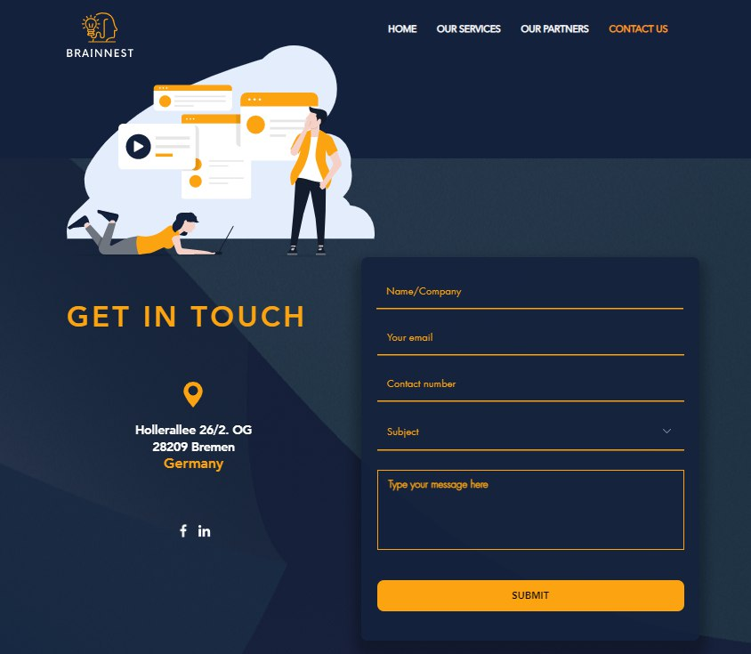
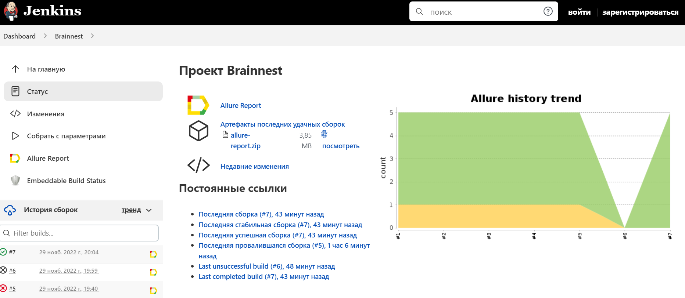
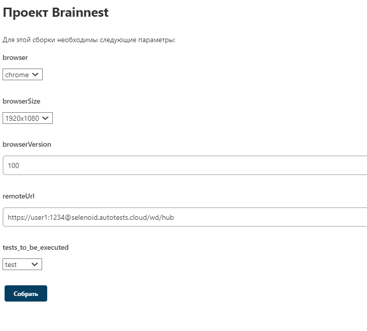
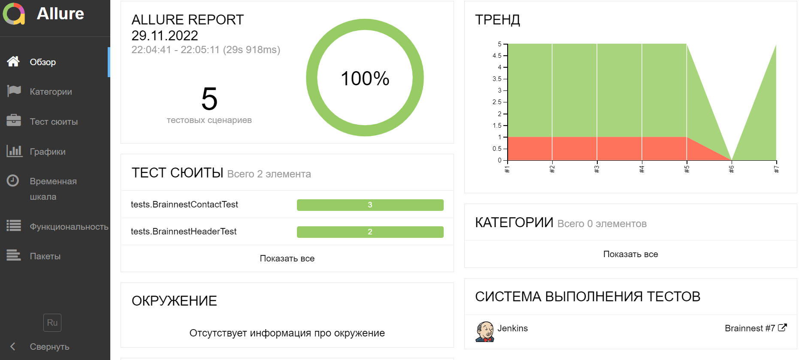
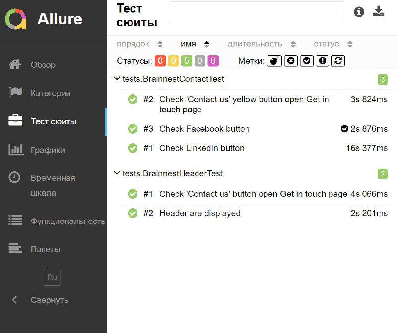
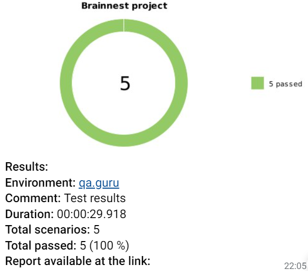

# Brainnest# Test automation project for [Brainnest](https://www.brainnest.consulting/)

<p  align="center">

</p>

# <a name="TableOfContents">Table of contents</a>
+ [Description](#Description)
  + [Tools and technologies](#Technology)
+ [How to run](#Jenkins)
    + [Gradle command](#GradleCommand)
    + [Run in Jenkins](#RunInJenkins)
+ [Telegram Notifications](#TelegramNotifications)


# <a name="Description">Description</a>
The test project consists of Web tests.
<p  align="center">



</p>
Test-run GIF
<p  align="center">

</p>

## <a name="Technology">Tools and a technologies</a>
<p  align="center">
  <code></code>
  <code></code>
  <code></code>
  <code></code>
  <code></code>
  <code></code>
  <code></code>
  <code></code>
  <code></code>
  <code></code>
</p>

The autotests in this project are written in `Java` using `Selenide` framework.\
`Gradle` - is used as a build automation tool.  \
`JUnit5` - to execute tests.\
`Jenkins` - CI/CD for running tests remotely.\
`Selenoid` - to remote launching browsers in `Docker` containers.\
`Allure Report` - for test results visualisation.\
`Telegram Bot` - for test results notifications.

[Back to the table of contents ⬆](#TableOfContents)

# <a name="HowToRun">How to run</a>

## <a name="GradleCommand">Gradle command</a>
To run locally and in Jenkins the following command is used:
```
gradle clean <tests_to_be_executed>   
```
tests_to_be_executed:
>`test` - all tests\
>`header` - header tests\
>`contact` - contact tests

Additional parameters:
> `-Dbrowser=browser` - browser\
> `-DbrowserSize=browserSize` - browser size\
> `-DremoteUrl=remoteUrl` - remote URL

[Back to the table of contents ⬆](#TableOfContents)


## <a name="RunInJenkins">Run in [Jenkins](https://jenkins.autotests.cloud/job/C15-anna_rkchv-Unit15_Project_HW/)</a>
Main page of the build and parameters for Jenkins job:
<p  align="center">


</p>

After the build is done the test results are available in <code>Allure Report</code>
<p  align="center">


</p>

[Back to the table of contents ⬆](#TableOfContents)


# <a name="TelegramNotifications">Telegram Notifications</a>
Results of each build are sent to a specified telegram chat.
<p  align="center">

</p>


[Back to the table of contents ⬆](#TableOfContents)
